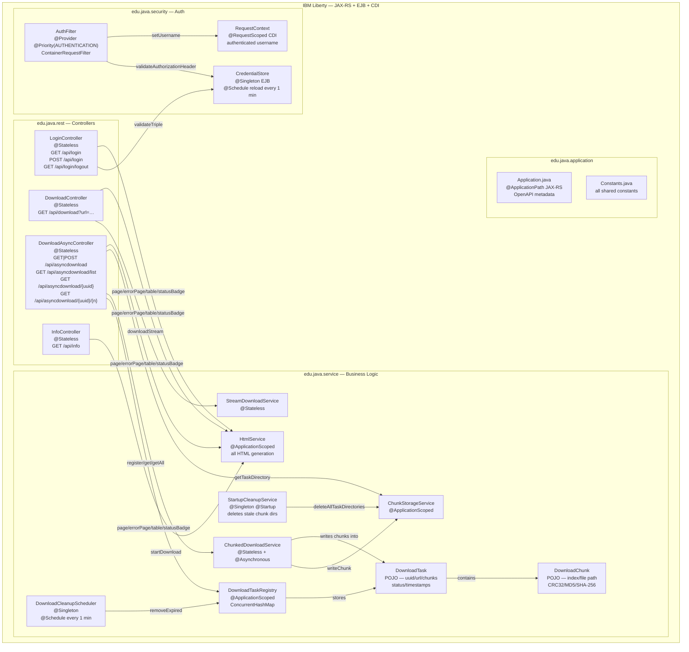
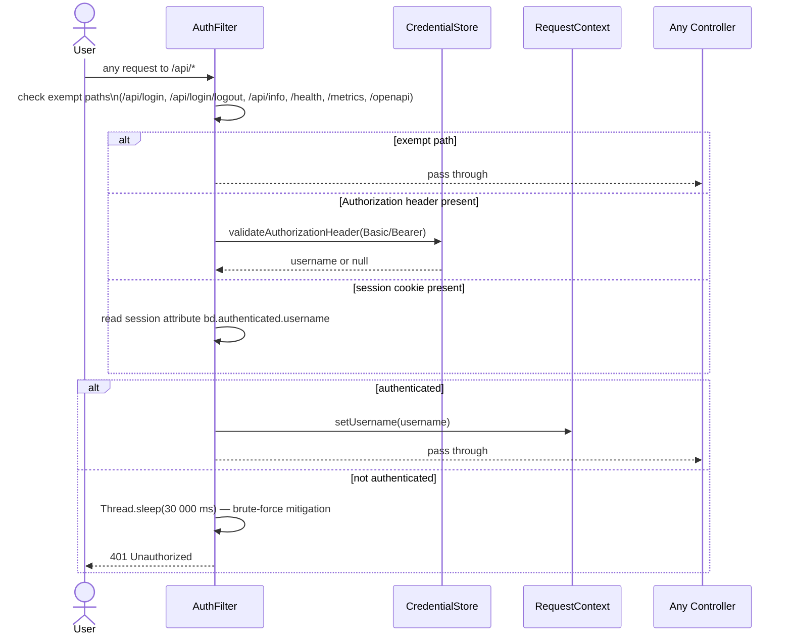
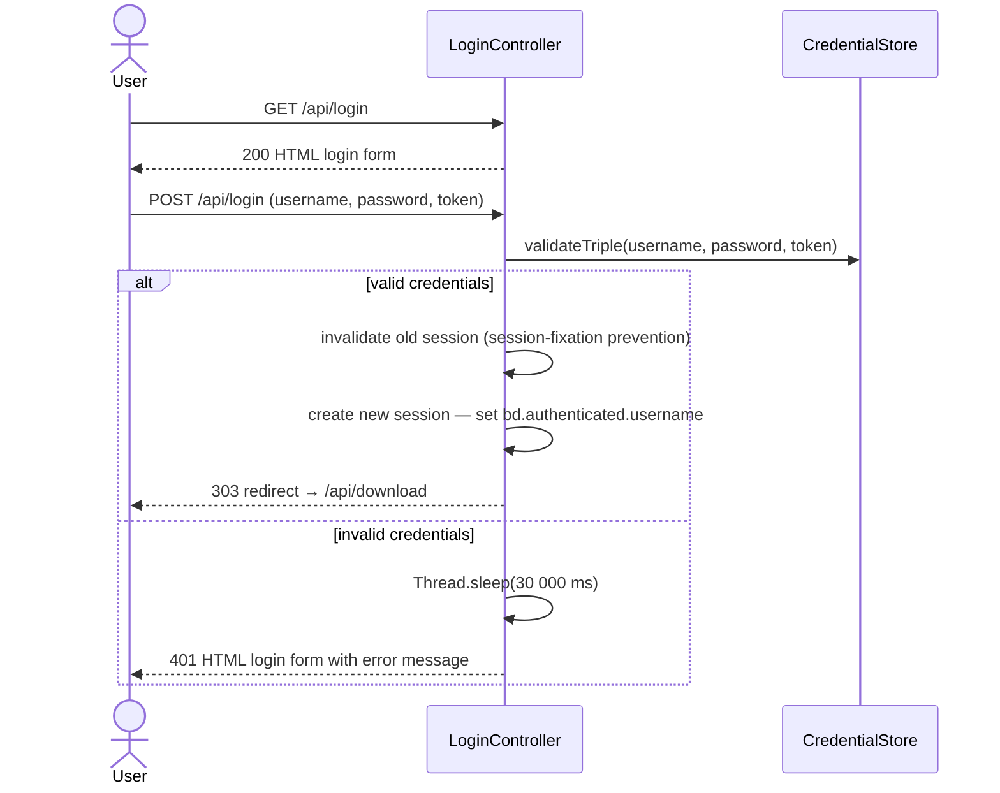
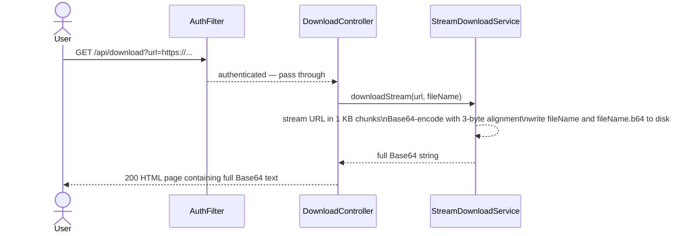
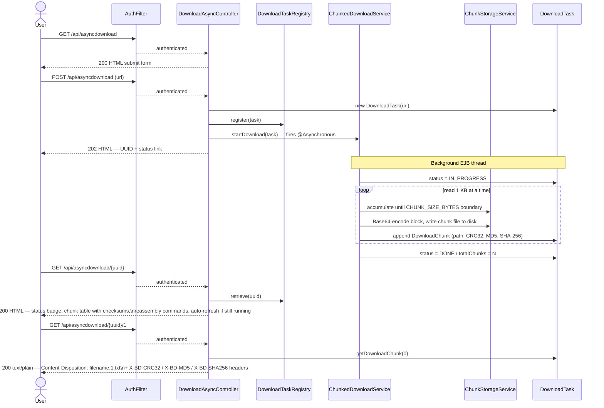
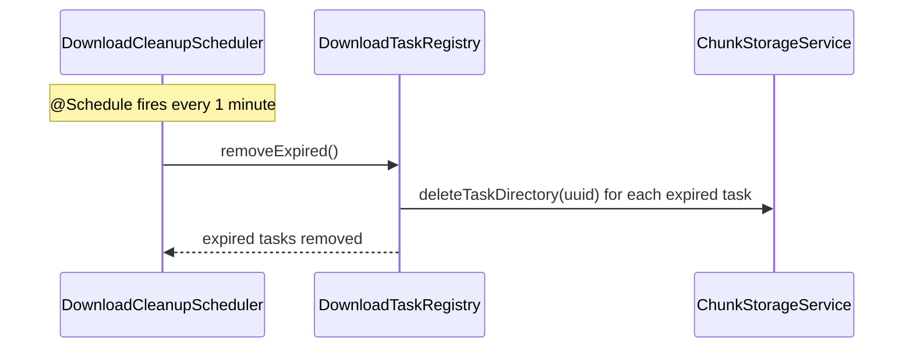
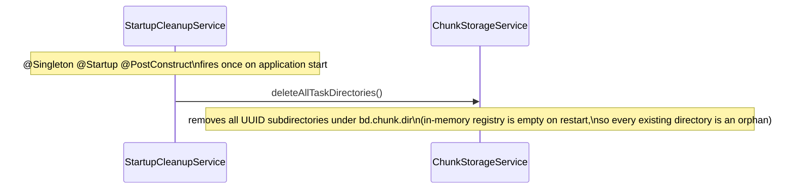

# BaseDownloader

A Jakarta EE REST web service that downloads remote resources (over HTTP, HTTPS, or FTP),
splits the binary content into fixed-size Base64-encoded chunks, and makes each chunk
available as a plain-text file download. This lets users in corporate environments — where
binary file downloads are blocked by firewalls — retrieve arbitrary files by downloading
plain-text chunks and reassembling them locally.

## 1. Architecture

### Overview

BaseDownloader is deployed as a WAR to IBM Liberty at context root `/BaseDownloader`.
All REST endpoints are rooted at `/BaseDownloader/api`. Every HTML page is served by the
application itself (no external CSS, JavaScript frameworks, or CDN dependencies).

---

### Package Structure

| Package | Role |
|---|---|
| `edu.java.application` | `Application.java` (JAX-RS entry point, OpenAPI metadata) and `Constants.java` (all shared string/int constants) |
| `edu.java.rest` | JAX-RS controllers only — HTTP glue, no business logic |
| `edu.java.security` | `AuthFilter` (JAX-RS `ContainerRequestFilter`), `CredentialStore`, `RequestContext` |
| `edu.java.service` | Business logic: download, chunking, registry, scheduler, HTML generation |

> **Note:** The `edu.java.util` and `security` (root package) directories are empty —
> both were removed during the Task 12 security refactor.

---

### Component Diagram



---

### Request Flows

#### Authentication — every protected request



#### Browser login flow — `GET /api/login` → `POST /api/login`



#### Legacy synchronous download — `GET /api/download?url=…`



> This is the original PoC endpoint, retained for backwards compatibility. The entire download
> runs synchronously on the HTTP request thread. Concurrent requests race on the output files
> (`{fileName}` and `{fileName}.b64`) — a known limitation.

#### Async chunked download — submit, poll, retrieve



#### Scheduled cleanup



#### Startup cleanup



---

## 2. Key Design Decisions

| Decision | Rationale |
|---|---|
| `ContainerRequestFilter` for auth (`AuthFilter`) | Centralises authentication in a single JAX-RS filter at `Priorities.AUTHENTICATION`. Controllers contain no credential-checking code and need not be modified when auth changes. |
| File-based credential store (`CredentialStore`) | Credentials live in `${server.config.dir}/bd-credentials.properties`, outside the WAR. Operators can add/change credentials without redeployment. The store reloads every minute. |
| Session + header dual auth | Browser users log in via the HTML form and receive an HTTP session cookie. Programmatic callers (scripts, OpenAPI UI) supply a `Basic` or `Bearer` `Authorization` header. Both paths are handled by `AuthFilter`. |
| 30-second delay on auth failure | Applied in both `AuthFilter` (header/session path) and `LoginController` (form path). Occupies one Liberty HTTP thread per failed attempt, making high-frequency credential guessing impractical. |
| Chunks written to disk (`ChunkStorageService`) | Allows chunks to survive a JVM garbage-collection cycle on large downloads. Each task gets a UUID-named subdirectory under `bd.chunk.dir` (`${java.io.tmpdir}/BaseDownloader` by default). |
| Per-chunk checksums (CRC32, MD5, SHA-256) | Computed during download so the status page can show a verification table and the browser can verify each downloaded chunk without re-requesting it. |
| Controllers use `@Stateless` not `@Singleton` | `@Singleton` EJBs serialise all method calls via a default write-lock. `@Stateless` uses a container-managed pool, enabling true concurrency. |
| `ChunkedDownloadService` uses `@Asynchronous` | The HTTP request thread returns the UUID immediately; the download runs in a separate EJB-managed thread. |
| Base64 chunk boundaries aligned to 3 bytes | Base64 encodes 3 raw bytes as 4 characters. Splitting at a non-multiple of 3 produces spurious `=` padding mid-stream, breaking `certutil -decode` and `base64 -d` on reassembly. |
| Submit URL via `POST` with `<textarea>` | Long URLs (deep FTP paths, query strings) can exceed browser/server URL-length limits (~8 KB) if passed as a query parameter. A form POST body has no practical length limit. |
| `HtmlService` owns all HTML generation | Every page uses a shared inline `<style>` block — no external CSS, no CDN. The appearance is fully self-contained in the WAR and works offline. Controllers call `HtmlService.page()` / `errorPage()` / `table()` / `statusBadge()` and contain only routing and data-fetch logic. |

---

## 3. REST API Summary

| Method | Path | Auth required | Description |
|---|---|---|---|
| `GET` | `/` | — | Redirects to `/BaseDownloader/` (Liberty `httpDispatcher`) |
| `GET` | `/BaseDownloader/` | — | Redirects to `/api/login` (welcome-file `index.html`) |
| `GET` | `/api/info` | — | Health check — returns plain-text `OK` |
| `GET` | `/api/login` | — | HTML login form |
| `POST` | `/api/login` | — | Validate username + password + token; creates session on success |
| `GET` | `/api/login/logout` | — | Invalidates the current session; returns logout confirmation page |
| `GET` | `/api/download?url=…` | ✓ | Legacy sync download — returns full Base64 HTML |
| `GET` | `/api/asyncdownload` | ✓ | HTML URL submission form |
| `POST` | `/api/asyncdownload` | ✓ | Submit async download; returns 202 + UUID |
| `GET` | `/api/asyncdownload/list` | ✓ | HTML list of all active download tasks |
| `GET` | `/api/asyncdownload/{uuid}` | ✓ | HTML status page — chunk table, checksums, reassembly commands |
| `GET` | `/api/asyncdownload/{uuid}/{n}` | ✓ | Download chunk `n` (1-based) as a `.txt` attachment |

OpenAPI / Swagger UI: `http://localhost:9080/openapi/ui`

---

## 4. Authentication

#### Browser login
Navigate to `http://localhost:9080/BaseDownloader/api/login`. Enter your username, password,
and token. On success you are redirected to the download form. To log out, visit
`/api/login/logout`.

#### Programmatic access (scripts, API clients)
Supply an `Authorization` header on every request:

```
Authorization: Basic <base64(username:password)>
```
or
```
Authorization: Bearer <token>
```

where `<token>` is the token value from the credential file (not the password).

#### Credential file

Location: `${server.config.dir}/bd-credentials.properties`
(default: Liberty's `wlp/usr/servers/<serverName>/bd-credentials.properties`)

```properties
# Format: username=password:token
# Lines starting with # and blank lines are ignored.
# Changes are picked up within ~1 minute — no server restart needed.

admin=s3cr3t:mytoken123
```

The file is outside the WAR and survives redeployment. Override the path in `server.xml`:
```xml
<variable name="bd.credentials.file" value="/secure/path/bd-credentials.properties"/>
```

---

## 5. Client-Side Reassembly

After downloading all chunks (`{name}.1.txt`, `{name}.2.txt`, …, `{name}.N.txt`) — the
exact commands are also shown on the status page with one-click copy buttons:

**Windows**
```bat
copy /b {name}.1.txt + {name}.2.txt + ... + {name}.N.txt {name}.txt
certutil -decode {name}.txt {originalFileName}
```

**Linux / macOS**
```bash
cat {name}.1.txt {name}.2.txt ... {name}.N.txt > {name}.txt
base64 -d {name}.txt > {originalFileName}
```

Chunk integrity can be verified before reassembly using the SHA-256, MD5, and CRC32 checksums
shown in the status-page chunk table and returned as `X-BD-SHA256`, `X-BD-MD5`, and
`X-BD-CRC32` response headers on each chunk download.

---

## 6. Configuration Reference

All configuration is in `src/main/liberty/config/server.xml`.

| Liberty variable | Default value | Description |
|---|---|---|
| `bd.chunk.dir` | `${java.io.tmpdir}/BaseDownloader` | Root directory for on-disk chunk storage |
| `bd.credentials.file` | `${server.config.dir}/bd-credentials.properties` | Path to the credential properties file |

---

### Server Configuration — Standalone Liberty Deployment

This section explains how to configure a standalone OpenLiberty (or WebSphere Liberty) server
to host BaseDownloader. If you only need a local development server, skip to
[Build & Run](#7-build-run) — `mvn liberty:run` handles everything automatically.

---

#### Prerequisites

| Requirement | Minimum version | Notes |
|---|---|---|
| Java | 8 | Java 11+ works equally well; the app targets `--release 8` |
| OpenLiberty | 23.0.0.x | Any recent GA release; download from [openliberty.io](https://openliberty.io/downloads/) |
| Required features | see `server.xml` below | `jakartaee-8.0`, `microProfile-4.1`, `adminCenter-1.0`, `restConnector-2.0`, `localConnector-1.0` |

WebSphere Liberty works identically — replace the `wlp/bin/installUtility` step with your
normal Liberty feature-installation procedure.

---

#### Step 1 — Create the server

After unzipping OpenLiberty into `/opt/wlp` (adjust the path for your OS):

```bash
/opt/wlp/bin/server create BaseDownloader
```

This creates the server directory at:

```
/opt/wlp/usr/servers/BaseDownloader/
```

---

#### Step 2 — Install required features

```bash
/opt/wlp/bin/installUtility install BaseDownloader
```

`installUtility` reads `server.xml`, resolves any missing features from the Liberty Maven
repository, and installs them. Run this once after creating the server (or after editing the
`<featureManager>` block).

---

#### Step 3 — Liberty configuration

Replace the generated `server.xml` with the template below.
Location: `/opt/wlp/usr/servers/BaseDownloader/server.xml`

```xml
<?xml version="1.0" encoding="UTF-8"?>
<server description="BaseDownloader Server">

    <!-- Enable features -->
    <featureManager>
        <feature>localConnector-1.0</feature>
    	<feature>adminCenter-1.0</feature>
		<feature>jakartaee-8.0</feature>
	    <feature>restConnector-2.0</feature>
        <feature>microProfile-4.1</feature>
    </featureManager>

    <!-- To access this server from a remote client add a host attribute to the following element, e.g. host="*" -->
	<httpEndpoint host="*" httpPort="${default.http.port}" httpsPort="${default.https.port}" id="defaultHttpEndpoint">
	        <accessLogging enabled="true" logFormat="%h %i %u %t &quot;%r&quot; %s %b %D"/>
	</httpEndpoint>
	
	<!-- ORB IIOP settings --> 
	<!-- 
	<iiopEndpoint host="localhost" id="defaultIiopEndpoint" iiopPort="${default.iiop.port}"/> 
	-->
	
	<!-- Message JMS Server settings -->
	<wasJmsEndpoint wasJmsPort="${default.jms.port}" wasJmsSSLPort="${default.jmss.port}"/>

	<!-- Default SSL configuration enables trust for default certificates from the Java runtime -->
	<ssl id="defaultSSLConfig" trustDefaultCerts="true"/>
	 
	<keyStore id="defaultKeyStore" password="${WLP_KEYSTORE_PASSWORD}"/>
	 
	<!-- Define  users -->
	<basicRegistry id="basic">
		<user name="${WLP_ADMIN_USERID}" password="${WLP_ADMIN_PASSWORD}"/>
	</basicRegistry>
	 
	<!-- A user with the administrator-role has full access to the Admin Center -->
	<administrator-role>
		<user>${WLP_ADMIN_USERID}</user>
	</administrator-role>
	 
	<!-- Allow AdminCenter to write configuration -->
	<remoteFileAccess>
		<writeDir>${server.config.dir}</writeDir>
	</remoteFileAccess>
	 
	<!-- Automatically expand WAR files and EAR files -->
	<applicationManager autoExpand="true"/>
	 
	<applicationMonitor updateTrigger="mbean"/>
	 
	<mpMetrics authentication="false"/>

	<logging maxFileSize="20" maxFiles="10" traceFileName="trace.log" traceFormat="BASIC" traceSpecification="eclipselink.sql=all"/>
	
   	<!--
   	   	Redirect http://localhost:9080/ (Liberty server root) to the application context root.
   	  	welcomePageRedirectEnabled=true makes Liberty issue a 302 to the first deployed
   	   	web application (BaseDownloader) when the server root is requested with no matching app.
   	-->
 <httpDispatcher welcomePageRedirectEnabled="true"/>
    
    <!--
        Credential file for BaseDownloader authentication.
        Format: one entry per line — username=password:token
        Lines starting with # are comments.
        The file is re-read periodically (every minute) so changes take effect without a restart.
        Override the path with: <variable name="bd.credentials.file" value="/secure/path/bd-credentials.properties"/>
    -->
    <variable name="bd.credentials.file" defaultValue="${server.config.dir}bd-credentials.properties" />
    
    <!-- DownloadChunk storage directory; override with <variable name="bd.chunk.dir" value="/your/path"/> -->
    <variable name="bd.chunk.dir" defaultValue="${java.io.tmpdir}BaseDownloader" />
    
    <webApplication contextRoot="BaseDownloader" id="BaseDownloader" location="BaseDownloader-1.0.0.war" name="BaseDownloader"/>
    
</server>
```

Replace the generated `jvm.options` with the template below.
Location: `/opt/wlp/usr/servers/BaseDownloader/jvm.options`

```text
-Ddefault.client.encoding=UTF-8
-Duser.country=US
-Duser.language=en
-Dxjavax.net.debug=ssl
-Dxjavax.net.debug=all
-Xms512m
-Xmx2048m
# Enable logger debugging.
#-Dlog4j2.debug=true
# Enable verbose output for class loading.
#-verbose:class

# Overwriting property in liberty-maven-plugin
#-Dlogback.configurationFile=X:/path/logback.xml

# Remote debug configuration
#-agentlib:jdwp=transport=dt_socket,server=y,suspend=n,address=5008

# HTTP debug options
#-Dcom.sun.xml.internal.ws.transport.http.HttpAdapter.dumpTreshold=true
#-Dcom.sun.xml.internal.ws.transport.http.HttpAdapter.dump=true
#-Dcom.sun.xml.ws.transport.http.HttpAdapter.dump=true
#-Dcom.sun.xml.internal.ws.transport.http.client.HttpTransportPipe.dump=true
#-Dcom.sun.xml.ws.transport.http.client.HttpTransportPipe.dump=true
```

Replace the generated `server.env` with the template below.
Location: `/opt/wlp/usr/servers/BaseDownloader/server.env`

```text
# WLP specific settings (keystore_password will be added upon first server start)
keystore_password=********
WLP_SKIP_MAXPERMSIZE=true
WLP_KEYSTORE_PASSWORD=liberty
WLP_ADMIN_USERID=admin
WLP_ADMIN_PASSWORD=adminpwd
# Application specific settings
```
Replace the generated `bootstrap.properties` with the template below.
Location: `/opt/wlp/usr/servers/BaseDownloader/bootstrap.properties`

```text
# Define HTTP ports
default.http.port=9080
default.https.port=9443
# Define JMS ports (defaults 7276, 7286)
default.jms.port=7276
default.jmss.port=7286
# Define IIOP ports (defaults 2809)
default.iiop.port=2809
 
# Define logging (alternative to server.xml) (see: https://www.ibm.com/support/knowledgecenter/SSEQTP_liberty/com.ibm.websphere.wlp.doc/ae/rwlp_logging.html)
#com.ibm.ws.logging.trace.file.name="stdout" (logging to "stdout" prevents server from starting)
#com.ibm.ws.logging.trace.specification="*=INFO:openjpa.jdbc=all"
#com.ibm.ws.logging.trace.append="true" (does not work)
#com.ibm.ws.logging.copy.system.streams="true"
```

---

#### Step 4 — Create `bd-credentials.properties`

Location: `/opt/wlp/usr/servers/BaseDownloader/bd-credentials.properties`
(matches the `bd.credentials.file` default value above)

```properties
# BaseDownloader credential store
# ---------------------------------------------------------------------------
# Format:   username=password:token
#
#   username  — login name for the HTML form and the user badge on status pages
#   password  — plain-text password used with Basic auth and the HTML login form
#   token     — opaque token accepted in  Authorization: Bearer <token>
#
# All three fields are required.  Lines starting with # and blank lines are
# ignored.  Changes are picked up within ~1 minute — no restart needed.
#
# SECURITY NOTE: passwords and tokens are stored in plain text in this
# proof-of-concept implementation.  For production use, protect this file
# with OS-level permissions (chmod 600 on Linux) and store it outside the
# application directory.
# ---------------------------------------------------------------------------

# Replace these example values before deploying:
admin=changeme:changeme-token
```

---

#### Step 5 — Deploy the WAR

Build the WAR and copy it to the Liberty `apps` directory:

```bash
mvn clean package
cp target/BaseDownloader-1.0.0.war /opt/wlp/usr/servers/BaseDownloader/apps/
```

With `<applicationManager autoExpand="true"/>` Liberty expands the WAR into a directory
alongside it on first start.

---

#### Step 6 — Start and stop the server

```bash
# Start in the foreground (Ctrl-C to stop)
/opt/wlp/bin/server run BaseDownloader

# Start in the background
/opt/wlp/bin/server start BaseDownloader

# Stop a background server
/opt/wlp/bin/server stop BaseDownloader

# Check server status
/opt/wlp/bin/server status BaseDownloader
```

Log files are written to:
```
/opt/wlp/usr/servers/BaseDownloader/logs/messages.log   ← main log
/opt/wlp/usr/servers/BaseDownloader/logs/trace.log      ← trace log
/opt/wlp/usr/servers/BaseDownloader/logs/http_access.log ← access log
```

---

#### Step 7 — Verify

| URL | Expected result |
|---|---|
| `http://host:9080/` | Redirects to `/BaseDownloader/api/login` |
| `http://host:9080/BaseDownloader/api/login` | HTML login form |
| `http://host:9080/BaseDownloader/api/info` | Plain-text `OK` |
| `http://host:9080/openapi/ui` | OpenAPI / Swagger UI |
| `https://host:9443/adminCenter` | Liberty Admin Center (Liberty admin credentials) |
| `http://host:9080/metrics` | MicroProfile Metrics (no credentials required) |

---

#### Optional — Override chunk directory and credential file path

Add or edit the `<variable>` elements in `server.xml` to redirect chunk storage or the
credential file to non-default locations:

```xml
<!-- Store chunks on a dedicated volume -->
<variable name="bd.chunk.dir" value="/data/BaseDownloader/chunks"/>

<!-- Credential file outside the server config directory -->
<variable name="bd.credentials.file" value="/etc/BaseDownloader/bd-credentials.properties"/>
```

Note: use `value=` (not `defaultValue=`) to unconditionally override the path.

---

## 7. Build & Run

```bash
# Build WAR (creates target/BaseDownloader-1.0.0.war)
mvn clean package

# Start Liberty with the application deployed
mvn liberty:run

# Package only — use when Liberty is already running (avoids clean)
mvn package -DskipTests
```

Application URL: `http://localhost:9080/BaseDownloader/`
