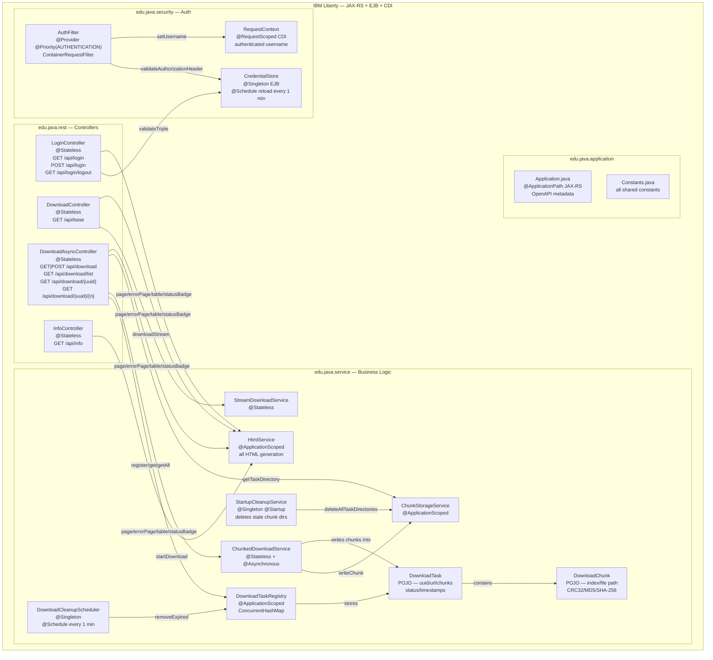
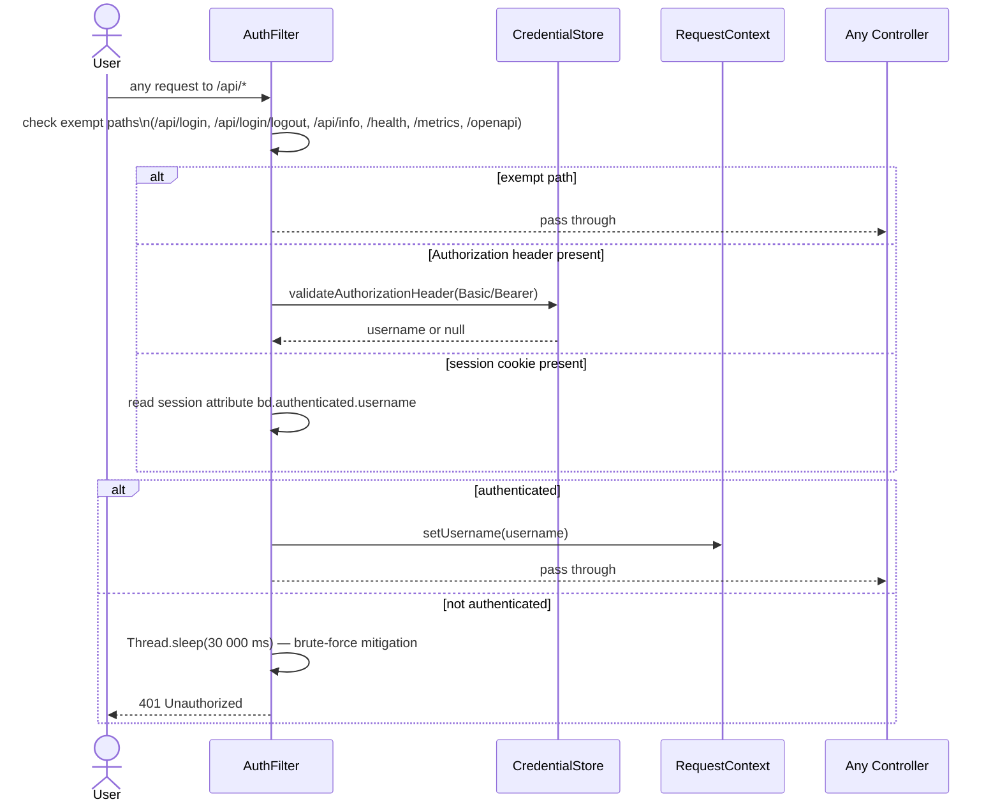
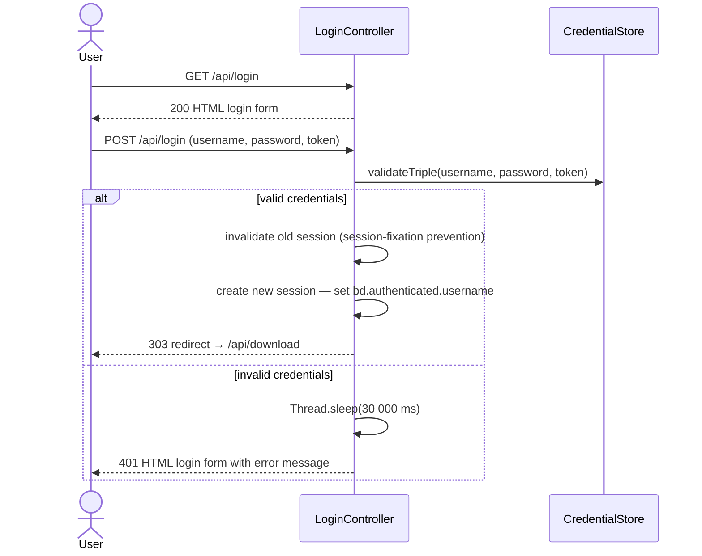
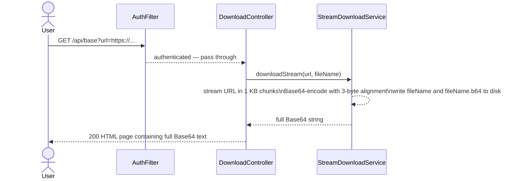
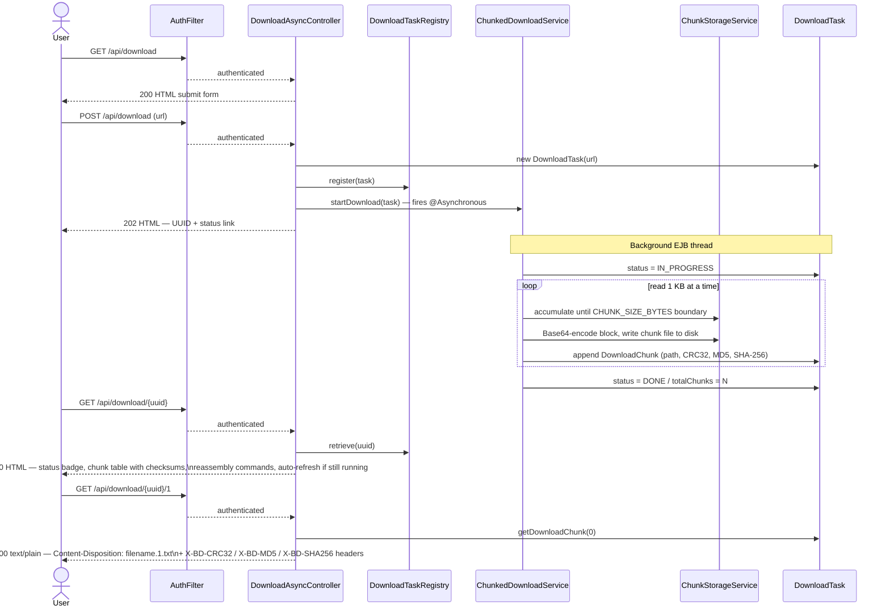
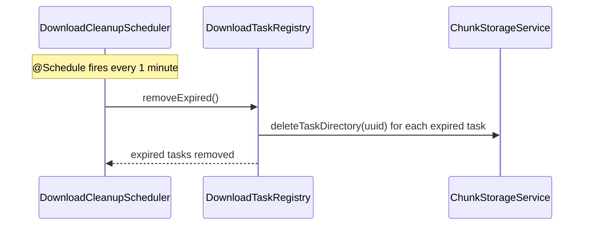
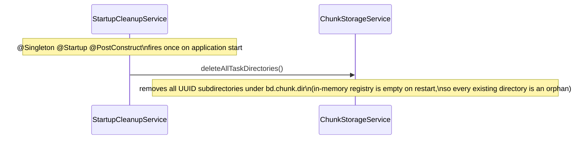

# BaseDownloader

A Jakarta EE REST web service that downloads remote resources (over HTTP, HTTPS, or FTP),
splits the binary content into fixed-size Base64-encoded chunks, and makes each chunk
available as a plain-text file download. This lets users in corporate environments — where
binary file downloads are blocked by firewalls — retrieve arbitrary files by downloading
plain-text chunks and reassembling them locally.

## Architecture

### Overview

BaseDownloader is deployed as a WAR to IBM Liberty at context root `/base-downloader`.
All REST endpoints are rooted at `/base-downloader/api`. Every HTML page is served by the
application itself (no external CSS, JavaScript frameworks, or CDN dependencies).

---

### Package Structure

| Package | Role |
|---|---|
| `edu.java.application` | `Application.java` (JAX-RS entry point, OpenAPI metadata) and `Constants.java` (all shared string/int constants) |
| `edu.java.rest` | JAX-RS controllers only — HTTP glue, no business logic |
| `edu.java.security` | `AuthFilter` (JAX-RS `ContainerRequestFilter`), `CredentialStore`, `RequestContext` |
| `edu.java.service` | Business logic: download, chunking, registry, scheduler, HTML generation |

> **Note:** The `edu.java.util` and `security` (root package) directories are empty —
> both were removed during the Task 12 security refactor.

---

### Component Diagram



---

### Request Flows

#### Authentication — every protected request



#### Browser login flow — `GET /api/login` → `POST /api/login`



#### Legacy synchronous download — `GET /api/base?url=…`



> This is the original PoC endpoint, retained for backwards compatibility. The entire download
> runs synchronously on the HTTP request thread. Concurrent requests race on the output files
> (`{fileName}` and `{fileName}.b64`) — a known limitation.

#### Async chunked download — submit, poll, retrieve



#### Scheduled cleanup



#### Startup cleanup



---

### Key Design Decisions

| Decision | Rationale |
|---|---|
| `ContainerRequestFilter` for auth (`AuthFilter`) | Centralises authentication in a single JAX-RS filter at `Priorities.AUTHENTICATION`. Controllers contain no credential-checking code and need not be modified when auth changes. |
| File-based credential store (`CredentialStore`) | Credentials live in `${server.config.dir}/bd-credentials.properties`, outside the WAR. Operators can add/change credentials without redeployment. The store reloads every minute. |
| Session + header dual auth | Browser users log in via the HTML form and receive an HTTP session cookie. Programmatic callers (scripts, OpenAPI UI) supply a `Basic` or `Bearer` `Authorization` header. Both paths are handled by `AuthFilter`. |
| 30-second delay on auth failure | Applied in both `AuthFilter` (header/session path) and `LoginController` (form path). Occupies one Liberty HTTP thread per failed attempt, making high-frequency credential guessing impractical. |
| Chunks written to disk (`ChunkStorageService`) | Allows chunks to survive a JVM garbage-collection cycle on large downloads. Each task gets a UUID-named subdirectory under `bd.chunk.dir` (`${java.io.tmpdir}/Base-Downloader` by default). |
| Per-chunk checksums (CRC32, MD5, SHA-256) | Computed during download so the status page can show a verification table and the browser can verify each downloaded chunk without re-requesting it. |
| Controllers use `@Stateless` not `@Singleton` | `@Singleton` EJBs serialise all method calls via a default write-lock. `@Stateless` uses a container-managed pool, enabling true concurrency. |
| `ChunkedDownloadService` uses `@Asynchronous` | The HTTP request thread returns the UUID immediately; the download runs in a separate EJB-managed thread. |
| Base64 chunk boundaries aligned to 3 bytes | Base64 encodes 3 raw bytes as 4 characters. Splitting at a non-multiple of 3 produces spurious `=` padding mid-stream, breaking `certutil -decode` and `base64 -d` on reassembly. |
| Submit URL via `POST` with `<textarea>` | Long URLs (deep FTP paths, query strings) can exceed browser/server URL-length limits (~8 KB) if passed as a query parameter. A form POST body has no practical length limit. |
| `HtmlService` owns all HTML generation | Every page uses a shared inline `<style>` block — no external CSS, no CDN. The appearance is fully self-contained in the WAR and works offline. Controllers call `HtmlService.page()` / `errorPage()` / `table()` / `statusBadge()` and contain only routing and data-fetch logic. |

---

### REST API Summary

| Method | Path | Auth required | Description |
|---|---|---|---|
| `GET` | `/` | — | Redirects to `/base-downloader/` (Liberty `httpDispatcher`) |
| `GET` | `/base-downloader/` | — | Redirects to `/api/login` (welcome-file `index.html`) |
| `GET` | `/api/info` | — | Health check — returns plain-text `OK` |
| `GET` | `/api/login` | — | HTML login form |
| `POST` | `/api/login` | — | Validate username + password + token; creates session on success |
| `GET` | `/api/login/logout` | — | Invalidates the current session; returns logout confirmation page |
| `GET` | `/api/base?url=…` | ✓ | Legacy sync download — returns full Base64 HTML |
| `GET` | `/api/download` | ✓ | HTML URL submission form |
| `POST` | `/api/download` | ✓ | Submit async download; returns 202 + UUID |
| `GET` | `/api/download/list` | ✓ | HTML list of all active download tasks |
| `GET` | `/api/download/{uuid}` | ✓ | HTML status page — chunk table, checksums, reassembly commands |
| `GET` | `/api/download/{uuid}/{n}` | ✓ | Download chunk `n` (1-based) as a `.txt` attachment |

OpenAPI / Swagger UI: `http://localhost:9080/openapi/ui`

---

### Authentication

#### Browser login
Navigate to `http://localhost:9080/base-downloader/api/login`. Enter your username, password,
and token. On success you are redirected to the download form. To log out, visit
`/api/login/logout`.

#### Programmatic access (scripts, API clients)
Supply an `Authorization` header on every request:

```
Authorization: Basic <base64(username:password)>
```
or
```
Authorization: Bearer <token>
```

where `<token>` is the token value from the credential file (not the password).

#### Credential file

Location: `${server.config.dir}/bd-credentials.properties`
(default: Liberty's `wlp/usr/servers/<serverName>/bd-credentials.properties`)

```properties
# Format: username=password:token
# Lines starting with # and blank lines are ignored.
# Changes are picked up within ~1 minute — no server restart needed.

admin=s3cr3t:mytoken123
```

The file is outside the WAR and survives redeployment. Override the path in `server.xml`:
```xml
<variable name="bd.credentials.file" value="/secure/path/bd-credentials.properties"/>
```

---

### Client-Side Reassembly

After downloading all chunks (`{name}.1.txt`, `{name}.2.txt`, …, `{name}.N.txt`) — the
exact commands are also shown on the status page with one-click copy buttons:

**Windows**
```bat
copy /b {name}.1.txt + {name}.2.txt + ... + {name}.N.txt {name}.txt
certutil -decode {name}.txt {originalFileName}
```

**Linux / macOS**
```bash
cat {name}.1.txt {name}.2.txt ... {name}.N.txt > {name}.txt
base64 -d {name}.txt > {originalFileName}
```

Chunk integrity can be verified before reassembly using the SHA-256, MD5, and CRC32 checksums
shown in the status-page chunk table and returned as `X-BD-SHA256`, `X-BD-MD5`, and
`X-BD-CRC32` response headers on each chunk download.

---

### Configuration Reference

All configuration is in `src/main/liberty/config/server.xml`.

| Liberty variable | Default value | Description |
|---|---|---|
| `bd.chunk.dir` | `${java.io.tmpdir}/Base-Downloader` | Root directory for on-disk chunk storage |
| `bd.credentials.file` | `${server.config.dir}/bd-credentials.properties` | Path to the credential properties file |

---

### Build & Run

```bash
# Build WAR (creates target/base-downloader.war)
mvn clean package

# Start Liberty with the application deployed
mvn liberty:run

# Package only — use when Liberty is already running (avoids clean)
mvn package -DskipTests
```

Application URL: `http://localhost:9080/base-downloader/`
