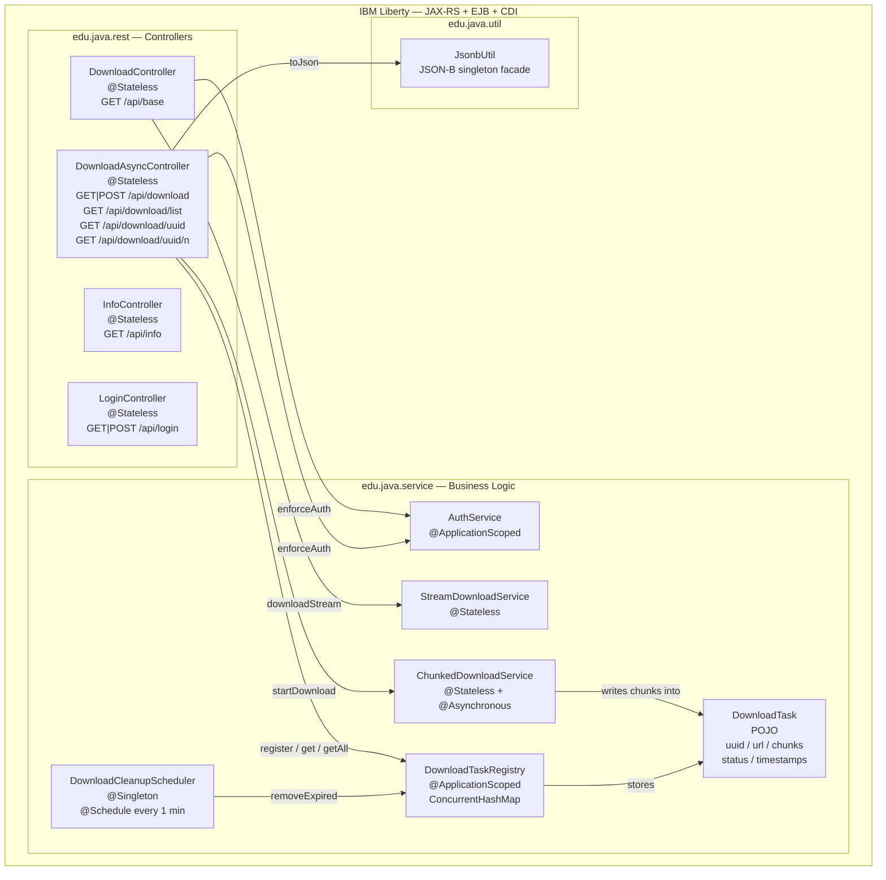
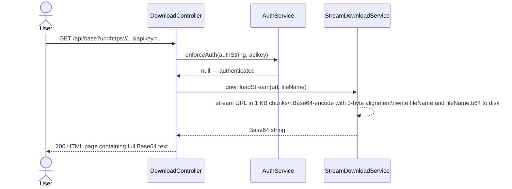
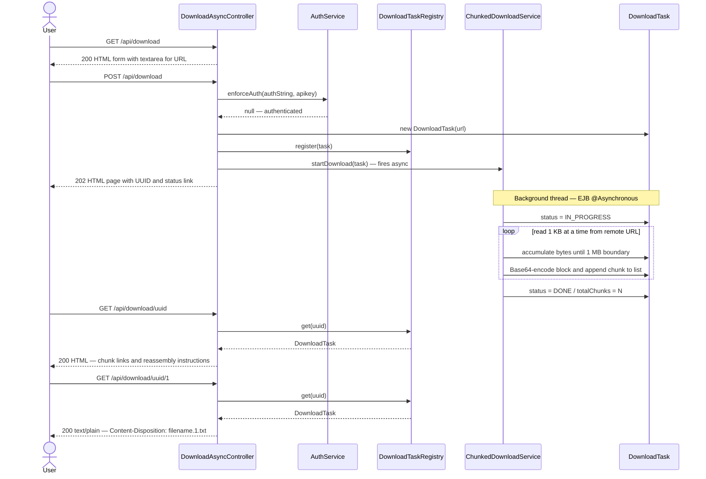
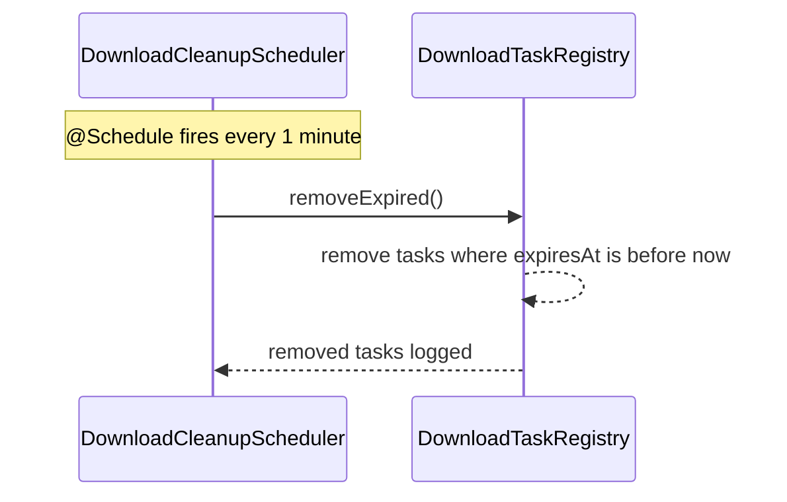

# BaseDownloader
Example for a Rest-WebService to download a resource and return it BASE64 encoded

## Architecture

### Overview

BaseDownloader is a Jakarta EE REST web service running on IBM Liberty. Its core purpose is to act
as a proxy that downloads remote resources (over HTTP, HTTPS, or FTP) from a server that has
unrestricted network access, splits the binary content into fixed-size chunks, and makes each
chunk available as plain Base64-encoded text. This lets users in corporate environments — where
binary file downloads are blocked by firewalls — retrieve arbitrary files by downloading plain-text
chunks and reassembling them locally.

The application is deployed as a WAR to Liberty at context root `/base-downloader`. All REST
endpoints are rooted at `/base-downloader/api`.

---

### Package Structure

| Package | Role |
|---|---|
| `edu.java.rest` | JAX-RS controllers only — HTTP glue, no business logic |
| `edu.java.service` | Business logic: auth, download, chunking, registry, scheduler |
| `edu.java.util` | Shared utilities (JSON serialisation) |
| `security` | CDI `HttpAuthenticationMechanism` infrastructure |

---

### Component Diagram



---

### Request Flows

#### Legacy synchronous download — `GET /api/base?url=…`



The entire download runs synchronously on the HTTP request thread. The response carries the
complete Base64 content in a single HTML page. This is the original PoC endpoint and is
retained for backwards compatibility. File output (`{fileName}` and `{fileName}.b64`) is
written to the Liberty working directory; concurrent requests to this endpoint race on those
files (known limitation — Gotcha 4).

---

#### Async chunked download — submit, poll, retrieve



Each chunk covers `ApiConstants.CHUNK_SIZE_BYTES` of original binary data (default 1 MB),
yielding ~1.37 MB of Base64 text per chunk. Chunks are held in-memory inside `DownloadTask`
and expire automatically after 1 hour.

---

#### Scheduled cleanup



---

### Key Design Decisions

| Decision | Rationale |
|---|---|
| Controllers use `@Stateless` not `@Singleton` | `@Singleton` EJBs serialise all method calls via a default write-lock. `@Stateless` uses a container-managed pool enabling true concurrency. |
| `ChunkedDownloadService` uses `@Asynchronous` | The HTTP request thread returns the UUID immediately; the download runs in a separate EJB-managed thread. |
| Chunks kept in memory, not on disk | Simplicity and atomicity; the scheduler cleans them up after 1 hour. The disk-file race of the legacy endpoint (Gotcha 4) is avoided entirely on the async path. |
| Base64 chunk boundaries aligned to 3 bytes | Base64 encodes 3 raw bytes as 4 characters. Splitting at a non-multiple of 3 produces spurious `=` padding mid-stream, breaking `certutil -decode` and `base64 -d` on reassembly. |
| Submit via `POST` with `@FormParam` and `textarea` | Long URLs (deep FTP paths, query strings with tokens) can exceed browser and server URL-length limits (~8 KB) if passed as `@QueryParam`. A form POST body has no practical length limit. |
| `DownloadTaskRegistry` uses `@ApplicationScoped` CDI with `ConcurrentHashMap` | A single shared registry with lock-free concurrent access from multiple pooled `@Stateless` controller instances. |

---

### REST API Summary

| Method | Path | Auth | Description |
|---|---|---|---|
| `GET` | `/api/info` | — | Health check, returns `OK` |
| `GET` | `/api/login` | — | Returns login HTML form |
| `POST` | `/api/login` | — | Accepts login credentials |
| `GET` | `/api/base?url=…` | ✓ | Legacy sync download — returns full Base64 HTML |
| `GET` | `/api/download` | — | Returns URL submission form |
| `POST` | `/api/download` | ✓ | Submit async download; returns 202 + UUID |
| `GET` | `/api/download/list` | ✓ | JSON list of all active download tasks |
| `GET` | `/api/download/{uuid}` | ✓ | HTML status page and chunk links for one task |
| `GET` | `/api/download/{uuid}/{n}` | ✓ | Download chunk `n` (1-based) as `.txt` attachment |

OpenAPI / Swagger UI is available at `/base-downloader/openapi/ui`.

---

### Client-Side Reassembly

After downloading all chunks (`{name}.1.txt`, `{name}.2.txt`, …, `{name}.N.txt`):

**Windows**
```bat
copy /b {name}.1.txt + {name}.2.txt + ... + {name}.N.txt {name}.txt
certutil -decode {name}.txt {originalFileName}
```

**Linux / macOS**
```bash
cat {name}.1.txt {name}.2.txt ... {name}.N.txt > {name}.txt
base64 -d {name}.txt > {originalFileName}
```

---

## Hints

To open multiple tabs from a HTML page use:

```
<script>
function openLinks(){
links = document.getElementsByTagName('a');

 for (i = 0; i < links.length;i++){ 
   window.open(links[i].getAttribute('href'),'_blank');
   window.focus();
 }
}
</script>
```

and:

```
<body onload="openLinks()">

<a href="http://google.com">google</a>
<a href="http://stackoverflow.com">stackoverflow</a>
<a href="http://facebook.com">facebook</a>
```
